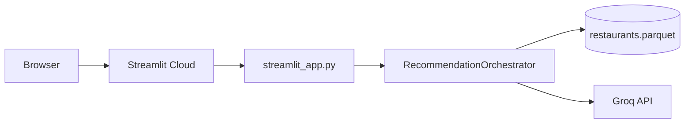

# Deployment Plan: Streamlit

Deploy the **Zomato AI Restaurant Recommendations** app using the legacy Streamlit UI. The Streamlit app calls `RecommendationOrchestrator` in-process (no separate FastAPI server required).

| Layer | Deploy target |
|-------|----------------|
| UI | Streamlit (`src/app/ui/streamlit_app.py`) |
| Business logic | In-process orchestrator, filter, LLM pipeline |
| Data | Local Parquet (`data/processed/restaurants.parquet`) |
| LLM | Groq API (external) |

**Recommended host:** [Streamlit Community Cloud](https://streamlit.io/cloud) (free tier, native Streamlit support).

---

## Table of Contents

1. [Architecture at deploy time](#architecture-at-deploy-time)
2. [Prerequisites](#prerequisites)
3. [Pre-deployment checklist](#pre-deployment-checklist)
4. [Prepare the repository](#prepare-the-repository)
5. [Deploy on Streamlit Community Cloud](#deploy-on-streamlit-community-cloud)
6. [Alternative hosts](#alternative-hosts)
7. [Environment variables](#environment-variables)
8. [Verify the deployment](#verify-the-deployment)
9. [Troubleshooting](#troubleshooting)
10. [Security and operations](#security-and-operations)

---

## Architecture at deploy time



Unlike the React + FastAPI setup, this deployment runs a **single Python process**. Users submit preferences in the Streamlit form; the orchestrator filters candidates, calls Groq, and renders recommendation cards.

---

## Prerequisites

| Requirement | Notes |
|-------------|-------|
| Python 3.11+ | Matches `pyproject.toml` |
| GitHub account | Streamlit Community Cloud deploys from GitHub |
| Groq API key | [console.groq.com](https://console.groq.com) — `gsk_…` |
| Processed dataset | `data/processed/restaurants.parquet` (~6 MB) |
| Public or private repo | Both work; private repos need Streamlit Cloud access |

---

## Pre-deployment checklist

- [ ] Ingestion completed locally (`python -m app.ingestion.pipeline` or `python scripts/ingest.py`)
- [ ] `data/processed/restaurants.parquet` exists and loads without errors
- [ ] Streamlit UI works locally (`python scripts/run_ui.py`)
- [ ] Groq key is valid (`python scripts/test_live_groq.py` optional)
- [ ] Secrets are **not** committed (`.env` stays gitignored)
- [ ] Code pushed to GitHub on the branch you want to deploy

---

## Prepare the repository

### 1. Include the dataset in the deploy branch

`data/processed/*` is gitignored by default. The deployed app **must** read Parquet at startup; Streamlit Cloud cannot run ingestion against Hugging Face on every cold start reliably.

**Option A — Commit processed data (recommended for MVP)**

```bash
# One-time: force-add the parquet for the deploy branch
git add -f data/processed/restaurants.parquet data/processed/restaurants.manifest.json
git commit -m "Add processed restaurant dataset for Streamlit deploy"
```

~6 MB is within GitHub’s normal file limits.

**Option B — Bootstrap script on first boot**

Add a startup hook that runs ingestion only if the file is missing. Slower cold starts and needs Hugging Face network access on the host. Use only if you cannot commit the Parquet file.

### 2. Ensure installable package layout

Streamlit Cloud installs dependencies from `requirements.txt`. Add an editable install so `import app` resolves from `src/`:

```text
# requirements.txt (add at the end)
-e .
```

Alternatively, keep `requirements.txt` as-is and rely on the `sys.path` bootstrap already in `streamlit_app.py` (lines 8–10). The editable install is more reliable on cloud hosts.

### 3. Optional Streamlit config

Create `.streamlit/config.toml` for consistent server behavior:

```toml
[server]
headless = true
enableCORS = false
enableXsrfProtection = true

[browser]
gatherUsageStats = false
```

### 4. Confirm entry point

| Setting | Value |
|---------|-------|
| Main module | `src/app/ui/streamlit_app.py` |
| Local launcher | `python scripts/run_ui.py` |

Do **not** deploy the React frontend (`scripts/run_frontend.py`) or FastAPI backend (`scripts/run_backend.py`) for this plan—they are separate from the Streamlit path.

---

## Deploy on Streamlit Community Cloud

### Step 1 — Push to GitHub

```bash
git push origin main
```

Use your deploy branch name if not `main`.

### Step 2 — Create the app

1. Go to [share.streamlit.io](https://share.streamlit.io) and sign in with GitHub.
2. Click **Create app**.
3. Select the repository, branch, and main file path:
   - **Main file path:** `src/app/ui/streamlit_app.py`
4. **App URL** — choose a subdomain (e.g. `zomato-ai-recs`).

### Step 3 — Configure secrets

In the app **Settings → Secrets**, paste TOML. Root-level string keys are exposed as environment variables, which `pydantic-settings` reads in `src/app/config.py`.

```toml
LLM_PROVIDER = "groq"
LLM_API_KEY = "gsk_your_key_here"
LLM_MODEL = "llama-3.3-70b-versatile"
GROQ_BASE_URL = "https://api.groq.com/openai/v1"
LLM_TEMPERATURE = "0.3"
LLM_TIMEOUT_SECONDS = "30"
LLM_MAX_RETRIES = "1"
MAX_CANDIDATES = "30"
DATA_PATH = "data/processed/restaurants.parquet"
HF_DATASET_ID = "ManikaSaini/zomato-restaurant-recommendation"
BUDGET_LOW_MAX = "500"
BUDGET_MEDIUM_MAX = "1500"
MAX_ADDITIONAL_PREFERENCES_LENGTH = "500"
```

Never commit real keys. Rotate any key that was ever committed.

### Step 4 — Deploy

Click **Deploy** (or **Reboot app** after secret changes). First build installs `requirements.txt` and starts Streamlit.

### Step 5 — Pin Python version (optional)

If the build picks the wrong Python, add `.python-version` at the repo root:

```text
3.11
```

Or set `PYTHON_VERSION = "3.11"` in Streamlit secrets (supported on some hosts).

---

## Alternative hosts

The same Streamlit entry point works on any container or VM that can run Python.

| Host | Approach |
|------|----------|
| **Docker** | `pip install -r requirements.txt && pip install -e .` then `streamlit run src/app/ui/streamlit_app.py --server.port=$PORT --server.address=0.0.0.0` |
| **Railway / Render / Fly.io** | Set start command above; inject env vars from dashboard |
| **Local server / VM** | `python scripts/run_ui.py` behind nginx reverse proxy |

Example `Dockerfile` sketch:

```dockerfile
FROM python:3.11-slim
WORKDIR /app
COPY requirements.txt pyproject.toml ./
COPY src ./src
COPY data/processed ./data/processed
RUN pip install --no-cache-dir -r requirements.txt && pip install -e .
EXPOSE 8501
CMD ["streamlit", "run", "src/app/ui/streamlit_app.py", \
     "--server.headless=true", "--server.address=0.0.0.0", "--server.port=8501"]
```

Pass secrets via the platform’s secret manager, not `ENV` in the image.

---

## Environment variables

| Variable | Required | Purpose |
|----------|----------|---------|
| `LLM_API_KEY` | Yes | Groq API key |
| `LLM_PROVIDER` | Yes | Must be `groq` |
| `LLM_MODEL` | No | Default `llama-3.3-70b-versatile` |
| `GROQ_BASE_URL` | No | Default Groq OpenAI-compatible URL |
| `DATA_PATH` | No | Default `data/processed/restaurants.parquet` (relative to project root) |
| `MAX_CANDIDATES` | No | Filter cap before LLM (default `30`) |
| `BUDGET_LOW_MAX` | No | Low band threshold in INR (default `500`) |
| `BUDGET_MEDIUM_MAX` | No | Medium band threshold (default `1500`) |

`GROQ_API_KEY` is supported as an alias for `LLM_API_KEY` in `config.py`.

---

## Verify the deployment

### Smoke test in the UI

1. Open the deployed URL.
2. Confirm the page loads without *“Restaurant dataset is not loaded”*.
3. Submit defaults: area **Koramangala**, budget **medium**, cuisine **North Indian**, rating **3.5**, top **5**.
4. Expect a spinner, then recommendation cards with explanations.
5. Open **Request details** expander — check `llm_model`, `filter_ms`, and `llm_latency_ms`.

### Expected behavior

| Scenario | Expected result |
|----------|-----------------|
| Valid filters | 1–5 cards with Groq explanations |
| No matches | Warning to broaden filters |
| Groq outage / bad key | Info banner; rating-based fallback still shows results |
| Missing Parquet | Error with ingestion instructions; app stops |

### Local parity check before deploy

```bash
cd "zomato milestone"
source .venv/bin/activate
python scripts/run_ui.py
# Opens http://localhost:8501
```

---

## Troubleshooting

| Symptom | Likely cause | Fix |
|---------|--------------|-----|
| `ModuleNotFoundError: No module named 'app'` | Package not on `PYTHONPATH` | Add `-e .` to `requirements.txt`; redeploy |
| Dataset not loaded | Parquet missing from repo | `git add -f data/processed/restaurants.parquet` and redeploy |
| Groq fallback every request | Invalid/expired API key | Update `LLM_API_KEY` in Streamlit secrets; reboot app |
| Build timeout | Heavy `datasets` install | Pin versions in `requirements.txt`; drop unused deps if you only deploy Streamlit |
| App sleeps / cold start slow | Free tier idle | Normal on Community Cloud; first request may take 30–60s |
| `budget_low_max must be less than budget_medium_max` | Misconfigured secrets | Ensure `BUDGET_LOW_MAX` < `BUDGET_MEDIUM_MAX` |

Check **Manage app → Logs** in Streamlit Cloud for stack traces.

---

## Security and operations

- **Secrets:** Use Streamlit Secrets or host env vars only. Do not ship `.env` in the image or repo.
- **Rate limits:** Groq enforces per-key quotas; monitor usage in the Groq console.
- **Public demo:** No auth in the MVP—anyone with the URL can use the app. Add Streamlit authentication or move API keys server-side if you need access control later.
- **Data updates:** Re-run ingestion locally, commit updated Parquet (or replace the file in your deploy artifact), and redeploy.
- **Cost:** Streamlit Community Cloud free tier + Groq free tier are sufficient for demos; watch Groq token usage under load.

---

## Related docs

- [README](../README.md) — local setup and Streamlit launcher
- [Architecture](../architecture.md) — presentation layer options
- [Implementation plan](../implementation-plan.md) — phase overview
- [.env.example](../.env.example) — full configuration reference
