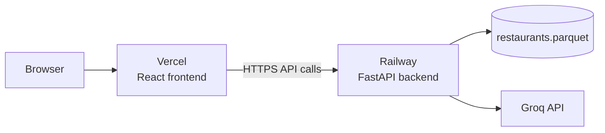

# Deployment Plan

Deploy the **Zomato AI Restaurant Recommendations** project as a split stack:

| Layer | Deploy target | Entry point |
|-------|---------------|-------------|
| **Frontend (DineAI)** | [Vercel](https://vercel.com) | `frontend/` — React + Vite |
| **Backend (API)** | [Railway](https://railway.app) | `src/app/main.py` — FastAPI + uvicorn |
| **Data** | Bundled with backend | `data/processed/restaurants.parquet` |
| **LLM** | External | Groq API |

**Alternative (legacy UI):** [Streamlit Community Cloud](#alternative-streamlit-community-cloud) — single-app deploy via `streamlit_app.py`.

---

## Table of Contents

1. [Architecture at deploy time](#architecture-at-deploy-time)
2. [Prerequisites](#prerequisites)
3. [Pre-deployment checklist](#pre-deployment-checklist)
4. [Prepare the repository](#prepare-the-repository)
5. [Deploy backend on Railway](#deploy-backend-on-railway)
6. [Deploy frontend on Vercel](#deploy-frontend-on-vercel)
7. [Environment variables](#environment-variables)
8. [Verify the deployment](#verify-the-deployment)
9. [Troubleshooting](#troubleshooting)
10. [Security and operations](#security-and-operations)
11. [Alternative: Streamlit Community Cloud](#alternative-streamlit-community-cloud)

---

## Architecture at deploy time



**Request flow**

1. User opens the Vercel-hosted DineAI UI.
2. Frontend calls the Railway API (`POST /api/v1/recommendations`, metadata endpoints).
3. Backend filters candidates from Parquet, calls Groq, returns JSON.
4. Frontend renders recommendation cards.

Locally, Vite proxies `/api` to `http://127.0.0.1:8000`. In production, the frontend must call the **public Railway URL** directly (see [Prepare the repository](#prepare-the-repository)).

---

## Prerequisites

| Requirement | Notes |
|-------------|-------|
| Python 3.11+ | Backend on Railway |
| Node.js 18+ | Frontend build on Vercel |
| GitHub repo | Both platforms deploy from Git |
| Groq API key | [console.groq.com](https://console.groq.com) |
| Processed dataset | `data/processed/restaurants.parquet` (~6 MB) committed or available on Railway |
| Railway account | [railway.app](https://railway.app) |
| Vercel account | [vercel.com](https://vercel.com) |

---

## Pre-deployment checklist

- [ ] Ingestion completed locally (`python -m app.ingestion.pipeline` or `python scripts/ingest.py`)
- [ ] `data/processed/restaurants.parquet` committed to Git (see below)
- [ ] Backend runs locally: `python scripts/run_backend.py` → `http://127.0.0.1:8000/docs`
- [ ] Frontend runs locally: `python scripts/run_frontend.py` → `http://localhost:5173`
- [ ] Code changes for production API URL and CORS applied (see [Prepare the repository](#prepare-the-repository))
- [ ] Groq key set in Railway env vars (never in Git)
- [ ] Code pushed to GitHub on the branch you want to deploy

---

## Prepare the repository

### 1. Commit the processed dataset

Railway needs the Parquet file at deploy time. It is gitignored by default.

```bash
git add -f data/processed/restaurants.parquet data/processed/restaurants.manifest.json
git commit -m "Add processed restaurant dataset for production deploy"
```

### 2. Point the frontend at the Railway API (production)

`frontend/src/api/client.ts` currently uses a relative base path (`/api/v1`), which only works with the Vite dev proxy. For Vercel, use an environment variable:

```typescript
const API_BASE = import.meta.env.VITE_API_BASE_URL ?? "/api/v1";
```

Add to `frontend/src/vite-env.d.ts`:

```typescript
interface ImportMetaEnv {
  readonly VITE_API_BASE_URL?: string;
}
```

On Vercel, set `VITE_API_BASE_URL` to your Railway public URL including the API prefix, e.g.:

```text
https://your-app.up.railway.app/api/v1
```

### 3. Allow the Vercel origin in backend CORS

`src/app/main.py` reads allowed origins from settings:

- `CORS_ORIGINS` — comma-separated exact origins (production Vercel URL + localhost)
- `CORS_ORIGIN_REGEX` — optional regex for Vercel preview URLs (e.g. `https://.*\.vercel\.app`)

Railway env vars (set after you know the Vercel URL):

```text
CORS_ORIGINS=https://your-app.vercel.app,http://localhost:5173
CORS_ORIGIN_REGEX=https://.*\.vercel\.app
```

Redeploy Railway after updating CORS.

### 4. Backend install layout

Ensure `requirements.txt` includes an editable install so Railway resolves `import app`:

```text
-e .
```

### 5. Push to GitHub

```bash
git push origin main
```

---

## Deploy backend on Railway

### Step 1 — Create a new project

1. Go to [railway.app](https://railway.app) and sign in with GitHub.
2. **New Project → Deploy from GitHub repo**.
3. Select your repository and branch (`main`).

### Step 2 — Configure the service

| Setting | Value |
|---------|-------|
| **Root directory** | `/` (repo root) |
| **Builder** | Nixpacks (default) or Dockerfile |
| **Start command** | See below |

**Start command (recommended):**

```bash
uvicorn app.main:app --host 0.0.0.0 --port $PORT --app-dir src
```

Railway injects `$PORT`. Do not hard-code `8000` in production.

**Optional `railway.toml` at repo root:**

```toml
[build]
builder = "NIXPACKS"

[deploy]
startCommand = "uvicorn app.main:app --host 0.0.0.0 --port $PORT --app-dir src"
healthcheckPath = "/api/v1/health"
healthcheckTimeout = 300
restartPolicyType = "ON_FAILURE"
```

### Step 3 — Environment variables

In Railway **Variables**, add:

```text
LLM_PROVIDER=groq
LLM_API_KEY=gsk_your_key_here
LLM_MODEL=llama-3.3-70b-versatile
GROQ_BASE_URL=https://api.groq.com/openai/v1
LLM_TEMPERATURE=0.3
LLM_TIMEOUT_SECONDS=30
LLM_MAX_RETRIES=1
MAX_CANDIDATES=30
DATA_PATH=data/processed/restaurants.parquet
HF_DATASET_ID=ManikaSaini/zomato-restaurant-recommendation
BUDGET_LOW_MAX=500
BUDGET_MEDIUM_MAX=1500
MAX_ADDITIONAL_PREFERENCES_LENGTH=500
CORS_ORIGINS=http://localhost:5173,http://127.0.0.1:5173
CORS_ORIGIN_REGEX=https://.*\.vercel\.app
```

Add your Vercel URL to `CORS_ORIGINS` after the frontend is deployed.

### Step 4 — Generate a public domain

1. Open the Railway service → **Settings → Networking**.
2. Click **Generate domain** (e.g. `your-app.up.railway.app`).
3. Copy the URL — you need it for Vercel.

### Step 5 — Verify backend

```bash
curl https://your-app.up.railway.app/api/v1/health
```

Expected: JSON with `"status": "ok"` and `"store_loaded": true`.

```bash
curl -X POST https://your-app.up.railway.app/api/v1/recommendations \
  -H "Content-Type: application/json" \
  -d '{"location":"Koramangala","budget":"medium","cuisine":"North Indian","min_rating":3.5,"top_k":3}'
```

---

## Deploy frontend on Vercel

Deploy **after** Railway is live so you have the API URL.

### Step 1 — Import the project

1. Go to [vercel.com/new](https://vercel.com/new) and import your GitHub repo.
2. Configure the project:

| Setting | Value |
|---------|-------|
| **Framework Preset** | Vite |
| **Root Directory** | `frontend` |
| **Build Command** | `npm run build` |
| **Output Directory** | `dist` |
| **Install Command** | `npm install` |

### Step 2 — Environment variables

In Vercel **Settings → Environment Variables**:

| Name | Value | Environments |
|------|-------|--------------|
| `VITE_API_BASE_URL` | `https://your-app.up.railway.app/api/v1` | Production, Preview |

Use your actual Railway domain. Redeploy if you change it.

### Step 3 — Deploy

Click **Deploy**. Vercel builds the React app and hosts it at e.g. `https://your-app.vercel.app`.

### Step 4 — Update Railway CORS

Add the Vercel URL to Railway `CORS_ORIGINS`:

```text
CORS_ORIGINS=https://your-app.vercel.app,http://localhost:5173
```

Redeploy or restart the Railway service.

### Optional — `vercel.json` in `frontend/`

```json
{
  "rewrites": [{ "source": "/(.*)", "destination": "/index.html" }]
}
```

Ensures client-side routing works if you add routes later. Not required for the current single-page app.

---

## Environment variables

### Railway (backend)

| Variable | Required | Purpose |
|----------|----------|---------|
| `LLM_API_KEY` | Yes | Groq API key |
| `LLM_PROVIDER` | Yes | Must be `groq` |
| `LLM_MODEL` | No | Default `llama-3.3-70b-versatile` |
| `GROQ_BASE_URL` | No | Groq OpenAI-compatible URL |
| `DATA_PATH` | No | Default `data/processed/restaurants.parquet` |
| `MAX_CANDIDATES` | No | Filter cap before LLM (default `30`) |
| `BUDGET_LOW_MAX` | No | Low band threshold INR (default `500`) |
| `BUDGET_MEDIUM_MAX` | No | Medium band threshold (default `1500`) |
| `CORS_ORIGINS` | Yes (prod) | Comma-separated allowed frontend origins |
| `CORS_ORIGIN_REGEX` | No | Regex for Vercel preview domains (e.g. `https://.*\.vercel\.app`) |

`GROQ_API_KEY` works as an alias for `LLM_API_KEY` in `config.py`.

### Vercel (frontend)

| Variable | Required | Purpose |
|----------|----------|---------|
| `VITE_API_BASE_URL` | Yes (prod) | Full Railway API base, e.g. `https://….railway.app/api/v1` |

Vite exposes only variables prefixed with `VITE_` to the browser.

---

## Verify the deployment

### End-to-end smoke test

1. Open the Vercel URL in a browser.
2. Confirm the preference form loads (areas and cuisines populate from Railway metadata).
3. Submit: area **Koramangala**, budget **medium**, cuisine **North Indian**, rating **3.5**, top **5**.
4. Expect loading state, then recommendation cards with Groq explanations.
5. Open browser DevTools → **Network** — API calls should go to `*.railway.app`, not `vercel.app/api`.

### Expected behavior

| Scenario | Expected result |
|----------|-----------------|
| Valid filters | 1–5 cards with explanations |
| No matches | Empty state in UI |
| Groq outage / bad key | Fallback banner; rating-based results |
| CORS misconfigured | Browser console CORS error; fix `CORS_ORIGINS` on Railway |
| Wrong `VITE_API_BASE_URL` | Network errors or 404 on API calls |

### Local parity before deploy

```bash
# Terminal 1 — backend
cd "zomato milestone"
.venv/bin/python scripts/run_backend.py

# Terminal 2 — frontend
.venv/bin/python scripts/run_frontend.py
# http://localhost:5173
```

---

## Troubleshooting

| Symptom | Likely cause | Fix |
|---------|--------------|-----|
| CORS error in browser | Vercel origin not in `CORS_ORIGINS` | Add Vercel URL to Railway env; redeploy backend |
| API calls go to `vercel.app/api/...` | Missing `VITE_API_BASE_URL` | Set on Vercel; rebuild frontend |
| `502` / connection refused | Backend not listening on `$PORT` | Use `--port $PORT` in Railway start command |
| `store_loaded: false` | Parquet missing from deploy | Commit `data/processed/restaurants.parquet` |
| `ModuleNotFoundError: app` | Package not installed | Ensure `-e .` in `requirements.txt` |
| Groq fallback every request | Invalid `LLM_API_KEY` | Update Railway variable |
| Vercel build fails | Wrong root directory | Set root to `frontend`, not repo root |
| Metadata dropdowns empty | Backend health / CORS / wrong API URL | Check `/api/v1/metadata/areas` in Network tab |

**Logs**

- Railway: service → **Deployments → View logs**
- Vercel: project → **Deployments → Build / Runtime logs**

---

## Security and operations

- **Secrets:** Groq key only on Railway — never in Git or Vercel (frontend env vars are public to the browser; only use `VITE_*` for non-secret URLs).
- **CORS:** Restrict `CORS_ORIGINS` to your Vercel domain(s), not `*`, when using credentials.
- **Rate limits:** Monitor Groq usage in the Groq console.
- **Public demo:** No auth in MVP — anyone with URLs can use the API. Add auth or rate limiting before a public launch.
- **Data updates:** Re-run ingestion locally, commit updated Parquet, redeploy Railway.
- **Cost:** Railway and Vercel free tiers + Groq free tier are enough for demos; watch usage under load.

---

## Alternative: Streamlit Community Cloud

Use this path if you want a **single Python app** without Vercel/Railway.

| Setting | Value |
|---------|-------|
| Host | [share.streamlit.io](https://share.streamlit.io) |
| Main file | `streamlit_app.py` (repo root) |
| Launcher (local) | `python scripts/run_ui.py` |

Streamlit runs the orchestrator in-process (no separate FastAPI). Configure secrets in **Settings → Secrets** (same keys as Railway backend env vars). Commit `data/processed/restaurants.parquet` or rely on the bootstrap script in `src/app/deploy/bootstrap.py`.

See `.streamlit/secrets.toml.example` for a secrets template.

---

## Related docs

- [README](../README.md) — local setup
- [Architecture](../architecture.md) — system design
- [Implementation plan](../implementation-plan.md) — phase overview
- [.env.example](../.env.example) — full backend configuration reference
