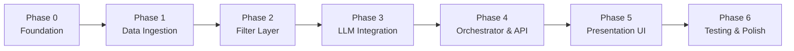

# Phase-Wise Implementation Plan

AI-Powered Restaurant Recommendation System (Zomato Use Case)

This plan translates [context.md](./context.md) and [architecture.md](../architecture.md) into a sequenced build roadmap. Each phase has clear deliverables, acceptance criteria, and dependencies so work can be tracked milestone-by-milestone.

---

## Guiding Principles

From the architecture, keep these constraints in mind throughout every phase:


| Principle                   | Implication                                                           |
| --------------------------- | --------------------------------------------------------------------- |
| **Filter before generate**  | Never call the LLM on the full dataset—filter deterministically first |
| **Bounded context**         | Cap candidates at 20–50 before prompt construction                    |
| **Structured + generative** | Dataset fields are source of truth; LLM only ranks and explains       |
| **Grounding**               | Recommendations must come from real dataset rows—no fabricated venues |
| **Single-tenant MVP**       | No auth, favorites, or order placement in initial scope               |


---

## Phase Overview




| Phase | Name                      | Outcome                                            |
| ----- | ------------------------- | -------------------------------------------------- |
| 0     | Project Foundation        | Runnable repo, config, domain models               |
| 1     | Data Ingestion & Storage  | Processed Zomato dataset ready for queries         |
| 2     | Filter Layer              | Deterministic candidate selection from preferences |
| 3     | LLM Integration           | Prompt, call, parse, merge pipeline                |
| 4     | Orchestrator & API        | End-to-end recommendation use case wired           |
| 5     | Presentation Layer        | User-facing form and results display               |
| 6     | Testing, Hardening & Docs | Reliable MVP ready to demo                         |


**Recommended stack (rapid path):** Python 3.11+, Streamlit UI, in-process orchestrator, Parquet/in-memory store, **Groq** for LLM inference.

---

## Phase 0: Project Foundation

**Goal:** Establish repository structure, dependencies, configuration, and canonical domain models so later phases plug in cleanly.

### Prerequisites

- Python 3.11+ installed
- Groq API key ([https://console.groq.com](https://console.groq.com))

### Tasks

- [ ] Scaffold repository per architecture layout
- [ ] Add `requirements.txt` (`datasets`, `pandas`, `pydantic`, `pydantic-settings`, `python-dotenv`, UI framework)
- [ ] Create `.env.example` with `LLM_PROVIDER=groq`, `LLM_API_KEY`, `LLM_MODEL`, `GROQ_BASE_URL`, `DATA_PATH`, `MAX_CANDIDATES`, budget thresholds
- [ ] Implement `src/app/config.py` using pydantic-settings
- [ ] Define domain models in `src/app/models/`:
  - `Restaurant` (id, name, location, cuisines, rating, estimated_cost, budget_band, metadata)
  - `UserPreferences` (location, budget, cuisine, min_rating, additional_preferences, top_k)
  - `Recommendation` and `RecommendationResponse`
  - `FilterCriteria` and `FilterResult`
- [ ] Add minimal `README.md` with setup instructions

### Deliverables

```
zomato-milestone/
├── docs/
├── data/raw/          data/processed/
├── src/app/
│   ├── config.py
│   └── models/
├── tests/
├── scripts/
├── .env.example
├── requirements.txt
└── README.md
```

### Acceptance Criteria

- `pip install -r requirements.txt` succeeds
- Config loads from environment with sensible defaults
- Domain models validate correctly (e.g., `min_rating` in [0, 5], budget enum)

---

## Phase 1: Data Ingestion & Storage

**Goal:** Load the Hugging Face Zomato dataset, normalize schema, derive budget bands, and persist for fast runtime reads.

**Maps to context:** System Workflow → Data Ingestion

### Prerequisites

- Phase 0 complete
- Network access to Hugging Face

### Tasks

- [ ] Implement `DatasetLoader` — fetch `ManikaSaini/zomato-restaurant-recommendation` via `datasets` library
- [ ] Inspect actual column names on first load; document mapping in `SchemaNormalizer`
- [ ] Implement `SchemaNormalizer` — map raw columns → canonical `Restaurant` model:
  - Name → trim, dedupe key
  - Location → case-insensitive city/locality string
  - Cuisines → split comma-separated, lowercase list
  - Cost → `estimated_cost` float + `budget_band` (low ≤ 500, medium ≤ 1500, high > 1500 — tune after EDA)
  - Rating → float for filtering
- [ ] Implement `Preprocessor` — handle nulls, normalize strings
- [ ] Implement `PersistenceWriter` — write to `data/processed/` (Parquet recommended for milestone)
- [ ] Create `scripts/ingest.py` / `python -m app.ingestion.pipeline` CLI entry point
- [ ] Implement `RestaurantRepository`:
  - `get_all()`, `filter(criteria)`, `get_by_ids(ids)`
- [ ] Wire startup load: repository reads processed artifact on app boot (or lazy load)

### Deliverables

- Processed dataset artifact in `data/processed/`
- Ingestion CLI runnable independently
- `RestaurantRepository` returning typed `Restaurant` objects

### Acceptance Criteria

- Ingest completes without errors on full HF dataset
- Sample query returns restaurants with all canonical fields populated
- Budget bands assigned consistently per configured thresholds
- Unit tests for `SchemaNormalizer` with sample HF rows pass

---

## Phase 2: Filter Layer

**Goal:** Apply deterministic filters on structured data and return a capped, pre-sorted candidate list—no LLM involved yet.

**Maps to context:** Integration Layer (filtering half)

### Prerequisites

- Phase 1 complete (repository loaded with real data)

### Tasks

- [ ] Implement `FilterService.filter(preferences, repository) -> FilterResult`
- [ ] Apply hard filters:
  - **Location** — substring or exact match on city/locality
  - **Budget** — match `budget_band`
  - **Cuisine** — any-match on `cuisines` list
  - **Min rating** — `rating >= min_rating`
  - **Additional preferences** — not filtered structurally; pass through to LLM later
- [ ] Post-filter: sort by rating desc (votes if available), cap at `MAX_CANDIDATES` (default 30)
- [ ] Handle edge cases:
  - Zero matches → return empty `FilterResult` (skip LLM downstream)
  - Too many matches → cap + pre-sort
- [ ] Return metadata: `total_before_cap`, `applied_filters` for logging/UI
- [ ] Write unit tests for each filter dimension and cap behavior

### Deliverables

- `src/app/services/filter_service.py`
- Filter unit test suite

### Acceptance Criteria

- Given preferences, filter returns only matching restaurants
- Candidate count never exceeds `MAX_CANDIDATES`
- Empty filter result is distinguishable from success (for orchestrator branching)
- Filter + in-memory read completes in < 100 ms on milestone data size

---

## Phase 3: LLM Integration Layer

**Goal:** Build prompt construction, LLM client abstraction, response parsing, and merge logic with robust fallbacks.

**Maps to context:** Integration Layer (prompt half) + Recommendation Engine

### Prerequisites

- Phase 2 complete
- Groq API key configured (`LLM_API_KEY`)

### Tasks

- [ ] Implement `LLMClient` interface with **GroqClient** (OpenAI-compatible chat completions API)
- [ ] Implement `PromptBuilder.build(preferences, candidates)`:
  - System message: restaurant advisor role, grounding constraint (only recommend from provided list)
  - User context: serialized preferences including `additional_preferences`
  - Candidate block: JSON/markdown table (id, name, location, cuisines, rating, cost, budget_band)
  - Task: rank top N, explain each, optional summary
  - Output contract: request structured JSON response
- [ ] Implement `ResponseParser`:
  - Parse JSON; validate ranks and `restaurant_id` values
  - Handle malformed output (regex extract JSON block)
  - Drop unknown IDs with warning log
- [ ] Implement `RecommendationMerger` — join parsed LLM output with `Restaurant` entities
- [ ] Implement fallback: if LLM fails or parse fails → top-K by rating with generic explanation
- [ ] Configure low temperature (0.2–0.5), retry once on timeout
- [ ] Add unit tests: prompt shape snapshots, parser valid/invalid JSON cases

### Deliverables

- `prompt_builder.py`, `llm_client.py`, `response_parser.py`
- Prompt template versioned in code (or `PromptTemplates` module)
- Parser and prompt unit tests

### Acceptance Criteria

- LLM returns only restaurants from the candidate list (no hallucinated venues)
- Parsed response includes rank, explanation, and optional summary per contract
- Fallback path works when LLM is unavailable or returns invalid JSON
- Token usage controlled: minimal fields per candidate, capped count

---

## Phase 4: Orchestrator & API Layer

**Goal:** Wire the full recommendation pipeline behind a single use-case entry point and optional REST API. All LLM calls go through **Groq**.

**Maps to context:** Full system workflow end-to-end (minus UI)

### Prerequisites

- Phases 1–3 complete
- Groq API key configured: [https://console.groq.com](https://console.groq.com)

### LLM Provider (Phase 4)


| Setting            | Value                                                                   |
| ------------------ | ----------------------------------------------------------------------- |
| **Provider**       | Groq only                                                               |
| **API base**       | `https://api.groq.com/openai/v1` (OpenAI-compatible chat completions)   |
| **Example models** | `llama-3.3-70b-versatile`, `llama-3.1-8b-instant`, `mixtral-8x7b-32768` |
| **Client**         | `GroqClient` in `llm_client.py`                                         |


`create_llm_client()` returns `GroqClient`. The orchestrator has no provider-specific branching.

**Example `.env`:**

```bash
LLM_PROVIDER=groq
LLM_API_KEY=gsk_...
LLM_MODEL=llama-3.3-70b-versatile
GROQ_BASE_URL=https://api.groq.com/openai/v1
```

### Tasks

- [ ] Implement `GroqClient` using Groq's OpenAI-compatible `/chat/completions` endpoint
- [ ] Wire `create_llm_client()` to return `GroqClient` (validate `LLM_PROVIDER=groq`)
- [ ] Implement `RecommendRestaurantsUseCase` / `RecommendationOrchestrator.execute(preferences)`:
  1. Validate preferences
  2. Filter candidates
  3. If empty → return empty response
  4. Build prompt → call LLM → parse → merge
  5. Return `RecommendationResponse`
- [ ] Add input validation at API boundary (reject empty location/cuisine, invalid rating)
- [ ] Implement REST API (choose based on UI path):
  - **Streamlit path:** call orchestrator in-process (no separate API required for MVP)
  - **React path:** FastAPI with `POST /api/v1/recommendations`, `GET /api/v1/health`
- [ ] Optional metadata endpoints: `GET /api/v1/metadata/locations`, `GET /api/v1/metadata/cuisines`
- [ ] Standardize error responses: 400 validation, 502 LLM failure, 503 store not loaded
- [ ] Add request logging: filter counts, Groq model, LLM latency, parse success/failure, correlation id
- [ ] Integration test: orchestrator with mocked LLM returning fixture JSON (provider-agnostic)

### Deliverables

- `src/app/services/orchestrator.py`
- `GroqClient` in `src/app/services/llm_client.py` (Phase 4)
- API routes (if FastAPI path) or in-process wiring for Streamlit
- Integration test with mocked LLM

### Acceptance Criteria

- Single call to orchestrator produces full `RecommendationResponse` from real preferences
- Empty candidate set skips LLM call and returns graceful empty response
- API layer never calls LLM directly—only through orchestrator
- End-to-end latency dominated by Groq LLM call; filter/parse stages under budget

---

## Phase 5: Presentation Layer

**Goal:** Build a user-friendly interface to collect preferences and display ranked recommendations with AI explanations.

**Maps to context:** User Input + Output Display

### Prerequisites

- Phase 4 complete (orchestrator callable)

### Tasks

#### Option A — Streamlit (recommended for fastest milestone)

- [ ] Single-page app: preference form + results
- [ ] Form fields map 1:1 to `UserPreferences`:
  - Location (text input / select from metadata)
  - Budget (select: low, medium, high)
  - Cuisine (text input / select)
  - Minimum rating (slider or number input)
  - Additional preferences (textarea, optional)
  - Top K (optional, default 5)
- [ ] Submit → loading spinner (`st.spinner`) during LLM call
- [ ] Results: optional summary paragraph + recommendation cards showing:
  - Restaurant name, cuisine, rating, estimated cost, location
  - AI-generated explanation, rank
- [ ] Empty state when no matches; error banner on LLM failure

#### Option B — React + FastAPI (portfolio/demo separation)

- [ ] React form component with same fields
- [ ] Results grid/list with card component
- [ ] Loading and error states
- [ ] Connect to FastAPI backend

### Deliverables

- Runnable UI entry point (`src/app/main.py`)
- Form validation mirrored at UI level
- Scannable results layout

### Acceptance Criteria

- User can submit preferences and receive top-K recommendations in one session
- Each card shows: name, cuisine, rating, cost, AI explanation (per context success criteria)
- Loading indicator visible during 2–15 s LLM wait
- Empty and error states are clear and actionable

---

## Phase 6: Testing, Hardening & Documentation

**Goal:** Validate reliability, tighten edge cases, and prepare the project for demo/submission.

### Prerequisites

- Phases 0–5 complete

### Tasks

- [ ] Complete test pyramid per architecture:

  | Layer            | Test type                                 |
  | ---------------- | ----------------------------------------- |
  | SchemaNormalizer | Unit                                      |
  | FilterService    | Unit                                      |
  | PromptBuilder    | Snapshot                                  |
  | ResponseParser   | Unit (valid/invalid JSON)                 |
  | Orchestrator     | Integration (mocked LLM)                  |
  | Full flow        | E2E golden path with recorded LLM fixture |

- [ ] Sanitize user input: max length on `additional_preferences`, trim strings
- [ ] Verify no secrets in repo; document `.env` setup in README
- [ ] Add health check if API deployed
- [ ] Optional: response cache keyed by hash of (preferences, candidate_ids)
- [ ] Final README: architecture summary, setup, ingest steps, run instructions, example screenshot
- [ ] Manual demo script: 2–3 preference scenarios that showcase personalization and explanations

### Deliverables

- Test suite passing in CI or locally
- Updated README and `.env.example`
- Demo-ready application

### Acceptance Criteria

- All unit and integration tests pass
- Success criteria from context.md met:
  - Recommendations reflect location, budget, cuisine, rating
  - LLM explanations are personalized, not generic boilerplate
  - Output is readable and actionable
  - System uses the specified Hugging Face dataset
- One-command startup after ingest (documented in README)

---

## Suggested Timeline


| Week | Phases | Focus                                                             |
| ---- | ------ | ----------------------------------------------------------------- |
| 1    | 0, 1   | Repo setup, ingest pipeline, explore dataset schema               |
| 2    | 2, 3   | Filter service, LLM prompt/parse/merge, iterate on prompt quality |
| 3    | 4, 5   | Orchestrator, Streamlit UI, wire end-to-end                       |
| 4    | 6      | Tests, polish, README, demo prep                                  |


Adjust pacing based on team size; Phases 2 and 3 can partially overlap once sample data exists.

---

## Phase Dependency Checklist

Use this as a quick gate before moving forward:


| Gate              | Question                                                            |
| ----------------- | ------------------------------------------------------------------- |
| **After Phase 0** | Can you import and instantiate all domain models?                   |
| **After Phase 1** | Can you load 100+ restaurants and query by location?                |
| **After Phase 2** | Does filter return ≤ 30 candidates matching test preferences?       |
| **After Phase 3** | Does a manual LLM call return valid JSON for a fixed candidate set? |
| **After Phase 4** | Does orchestrator return a full response without UI?                |
| **After Phase 5** | Can a non-developer use the app to get recommendations?             |
| **After Phase 6** | Do tests pass and does the demo script work reliably?               |


---

## Out of Scope (Defer to Future Extensions)

Per architecture, do **not** build these in the initial milestone:

- User accounts, saved favorites, order placement
- Real-time availability or live Zomato API
- Fine-tuned custom models
- Map visualization / geographic routing
- Async job queue for recommendations
- Multi-tenant auth

---

## Quick Reference: Component → Phase Mapping


| Architecture Component                 | Phase |
| -------------------------------------- | ----- |
| Data Ingestion Pipeline                | 1     |
| Restaurant Store & Repository          | 1     |
| User Input Module (models)             | 0     |
| User Input Module (UI)                 | 5     |
| Filter Service                         | 2     |
| Prompt Builder                         | 3     |
| LLM Client + Response Parser           | 3     |
| Recommendation Orchestrator            | 4     |
| API Layer                              | 4     |
| Presentation Layer                     | 5     |
| Cross-cutting (config, logging, tests) | 0, 6  |


